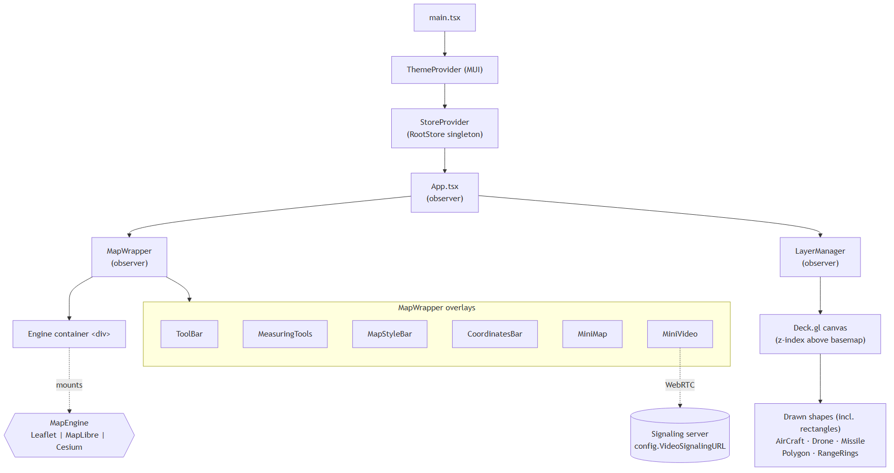
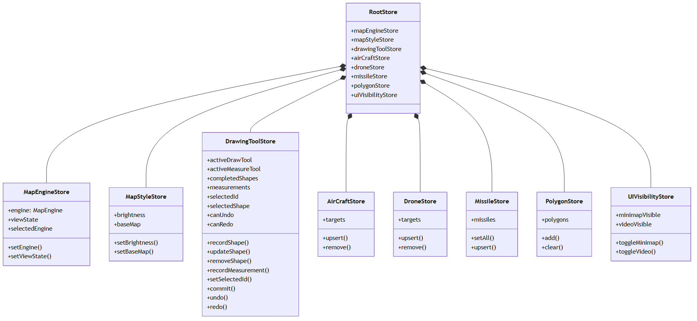
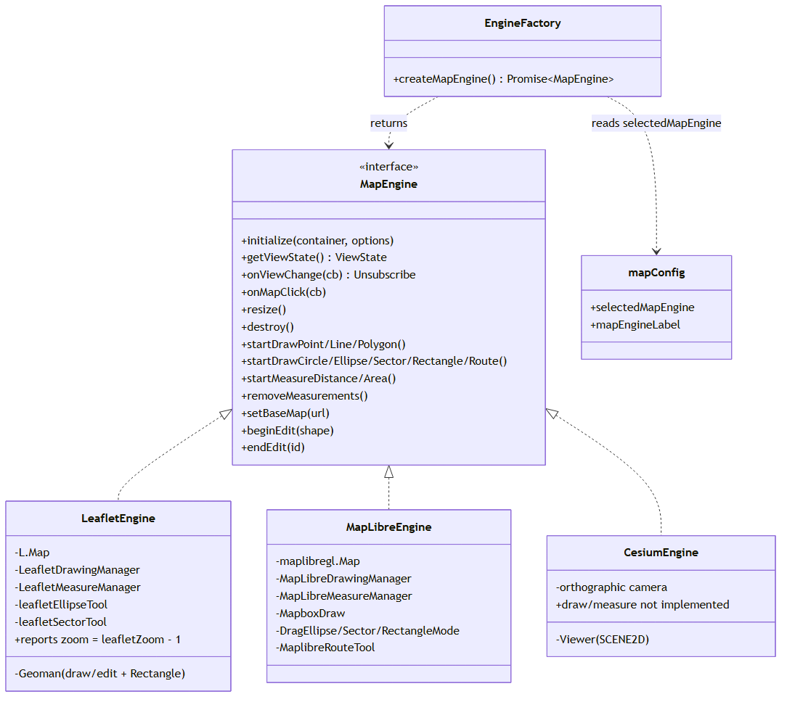
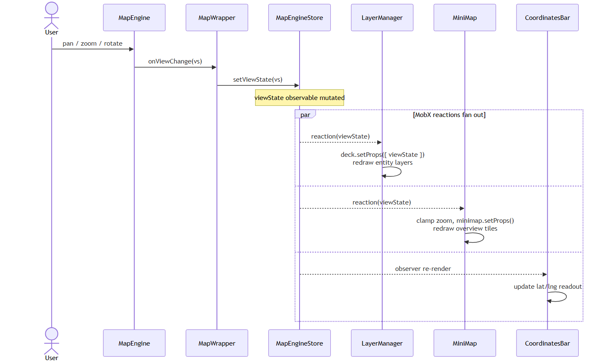
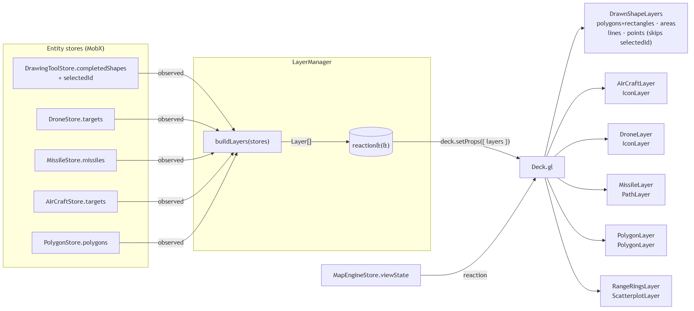
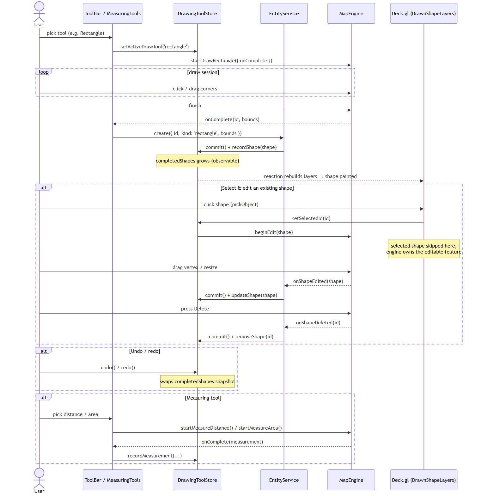

# MapApp Architecture Diagrams

These diagrams describe the structure and runtime data flow of MapApp.
Each one is provided as:

- a **PNG** rendered with [`@mermaid-js/mermaid-cli`](https://github.com/mermaid-js/mermaid-cli) — display-ready,
- a **`.mmd` Mermaid source** — editable; re-render with:

  ```powershell
  npx -y -p @mermaid-js/mermaid-cli@11 mmdc -i 01-architecture-overview.mmd -o 01-architecture-overview.png -b white -w 1800
  ```

---

## 1. Architecture overview

React tree, providers, map engine, and the deck.gl overlay.



Source: [01-architecture-overview.mmd](01-architecture-overview.mmd)

---

## 2. MobX stores

`RootStore` aggregates 8 observable stores; components read them via the
`useStores()` hook.



Source: [02-stores.mmd](02-stores.mmd)

---

## 3. Map engine abstraction

`MapEngine` is a stable interface so stores, layers and UI never depend
on a specific library. `EngineFactory` dynamically imports the chosen
implementation to keep the initial bundle small.



Source: [03-map-engine-abstraction.mmd](03-map-engine-abstraction.mmd)

---

## 4. View-change flow (pan / zoom)

`MapWrapper` owns the **single** subscription to the engine; everything
else observes `MapEngineStore.viewState`. This avoids multiple listeners
on the engine and keeps redraws synchronized.



Source: [04-view-change-flow.mmd](04-view-change-flow.mmd)

---

## 5. Layers data flow

`LayerManager` runs `buildLayers(stores)` inside a MobX reaction; any
read of an observed store causes the layer array to be rebuilt and
pushed to Deck.gl in one batched GPU call.



Source: [05-layers-data-flow.mmd](05-layers-data-flow.mmd)

---

## 6. Drawing & measuring flow

UI updates `DrawingToolStore`, then asks the active engine to start a
draw session. Completion flows through `EntityService` (the single
writer) into the store, and Deck.gl renders `completedShapes`. Selecting
a shape hands it to the engine for editing; vertex drags and deletes
round-trip back through `EntityService` (`update` / `remove`), with
`commit()` enabling undo/redo.



Source: [06-drawing-flow.mmd](06-drawing-flow.mmd)
